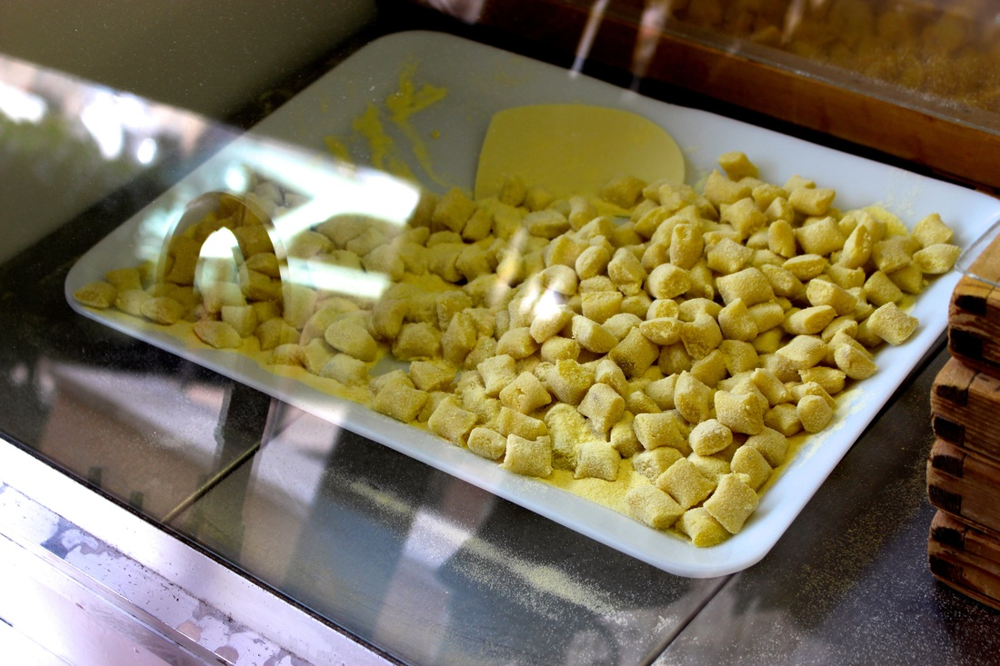
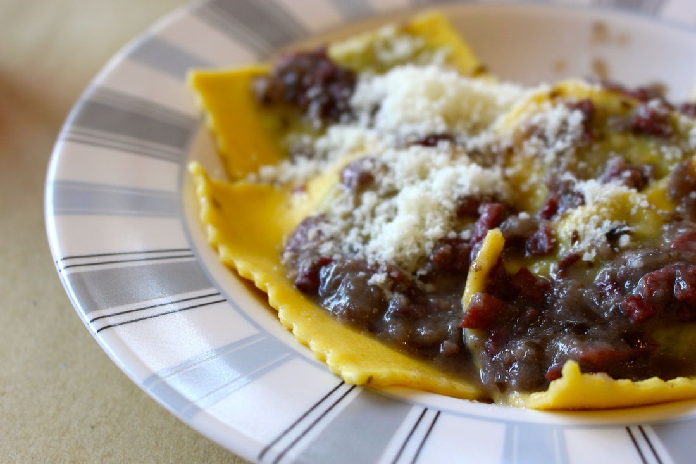
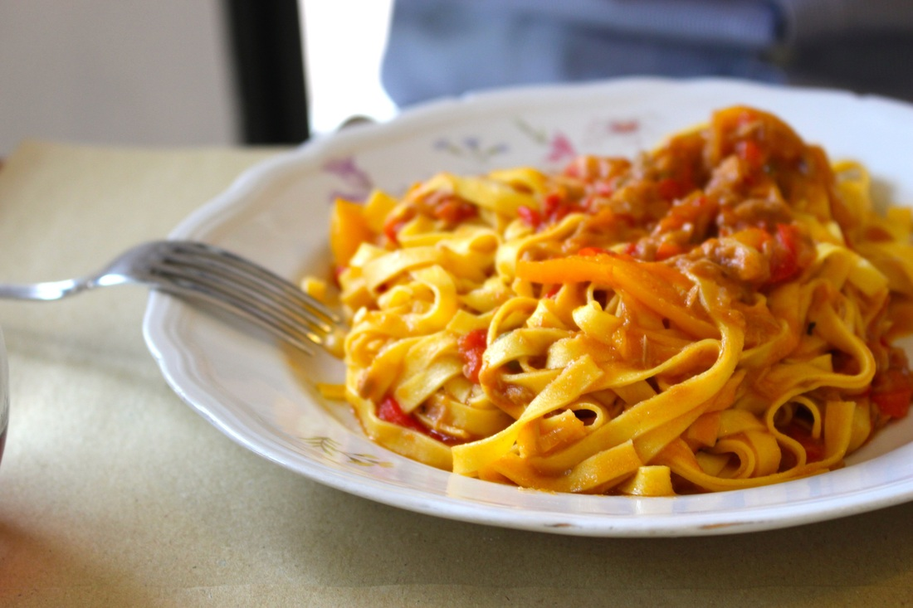

🇮🇹 **Forence, Italy**

**Address:** Via Domenico Cirillo 2/c. , Firenze, Italy  
**Telephone:** +39 055 578087  
**Recommendation:** ✩✩✩✩✩  
**Cost:** €

Freshly made pasta. OMG. I still drool when I think of those AMAZING PASTA! We were the first customers there. They opened at 12PM, we were there at 11:30PM. They are a true local pasta shop. The shop keeper came out with flour over his apron. We knew we came to the right place. Their menu are written on the wall. We had a bit of difficulty communicating with the server in English, so we just went with today's menu. You can choose one pasta and one sauce to go with it. Totally affordable. 2 pasta, 1 small wine jug, and 2 bruschetta for € 10. I tried their ravioli with purple onion/beef. Buonissimo!!! Well, it was worth the 20 minute walk under the hot sun to the shop. It was the best pasta I ever had. We even tried to go back on our last day. Unfortunately, it was closed. Boutique della Pasta Fresca, we shall meet again if I ever go back to Florence.