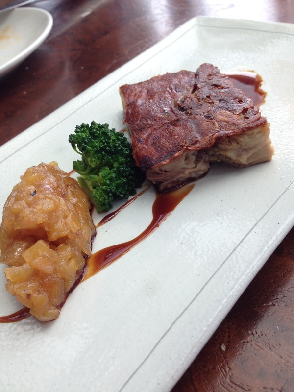
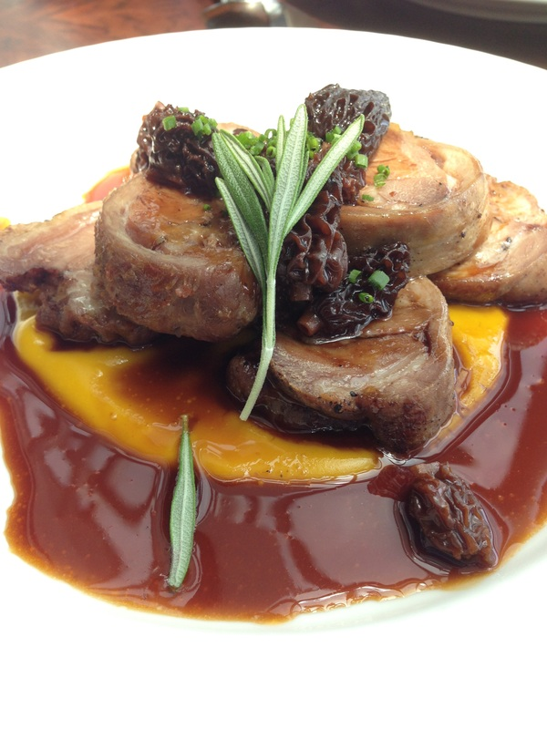
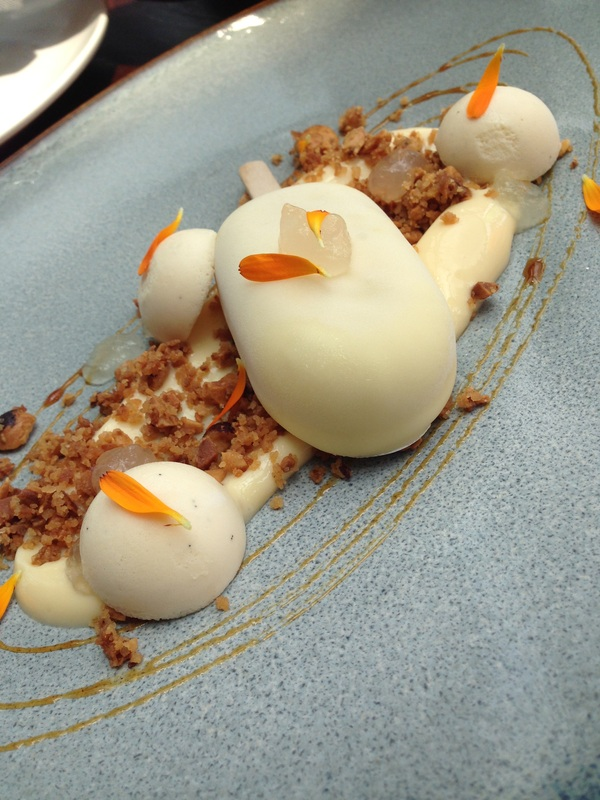

🇸🇬 **Singapore**

Catalunya has closed down 😢

~~**Address:** 82 Collyer Quay, Singapore 049327~~  
~~**Telephone:** +65 6534 0188~~   
~~[http://www.catalunya.sg/](http://www.catalunya.sg/ "http://www.catalunya.sg/")~~   
**Recommendation:** ✩✩✩✩✩ if you have the time & money  
**Cost:** $$$  
  
Valentine's Day Special Lunch  
  
This is the second time we have been to Catalunya. The first time we were here for their Sunday brunch with A's sister and brother in law. Their brunch is extremely popular!!! Catalunya's reservation typically opens 1 month before the date and gets booked pretty quickly. A had to wait by the phone to book this place for their Valentine's day special. They are famous for their tapas. There was a minimum spending per pax on Valentine's day. Brunches are fixed price if you don't drink any alcohol or order extra dishes. We only come here for special occasions.

**Avocado roll:** This is literally mouth-watering good. Highly recommend!!!  
  
**Catalunya Tartar:** The foam is actually potato. I think the tartar is good but the foam is sort of just a taste thing without much calories from the actual potato.   
  

**Calamari a la Andaluza:** These were really good! The batter is so crisp. It will definitely make you want more.

**Suckling pig:** The best thing ever. The pork is so soft yet the pig skin is so crispy. You must order this dish at least once. During their brunch special, servers would use plates to cut the suckling pig to tell you how tender/soft the meat is.   

**Lamb with pumpkin puree and morels:** A doesn't like lamb. I convinced him to try this dish. It turned out to be great. Meat is Catalunya's specialty so you must order meat items if you are there.   
  
**Rigatoni with truffles and parmesan cream:** I didn't like this dish. I thought the parmesan was too over powering. They gave us lots of truffles but the taste is hidden by the strong parmesan.   

**Catalan ice-cream:** Sort of a more classy version of Haagen-Dazs ice-cream. The white-chocolate is slightly sweeter. I tend to like the Japanese desserts more than the European desserts, so this is not my favorite.   
  
The whole lunch took about 2 hours. If I recalled, our Sunday brunch here was 3.5 hours long. Much much longer than what we are used to and we pretty much didn't eat anything else for the rest of the day. I do like the atmosphere. Super relaxed and just really enjoyed my meal with A. BTW excellent service. Free champagne for a birdie that was flying inside of the restaurant.