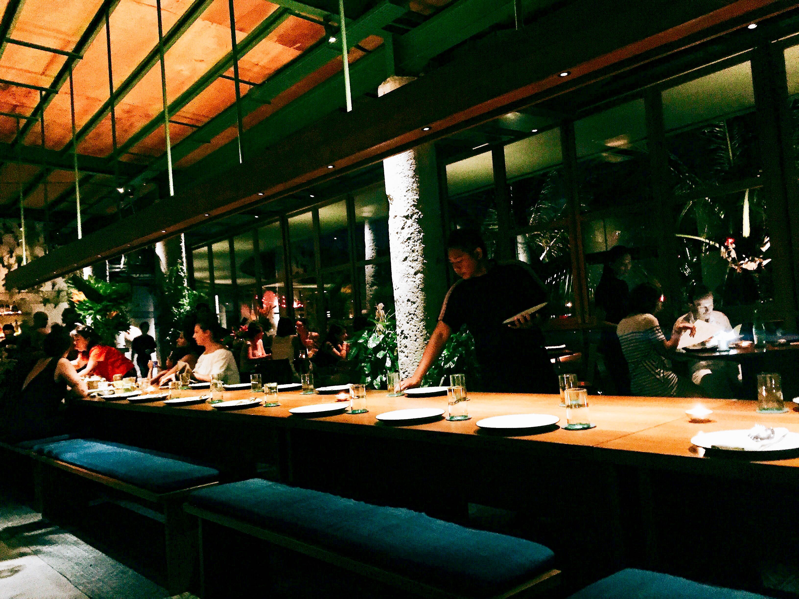
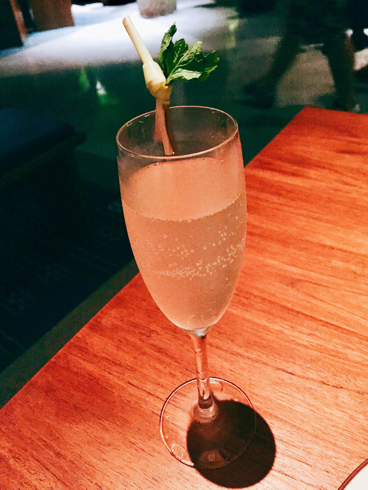
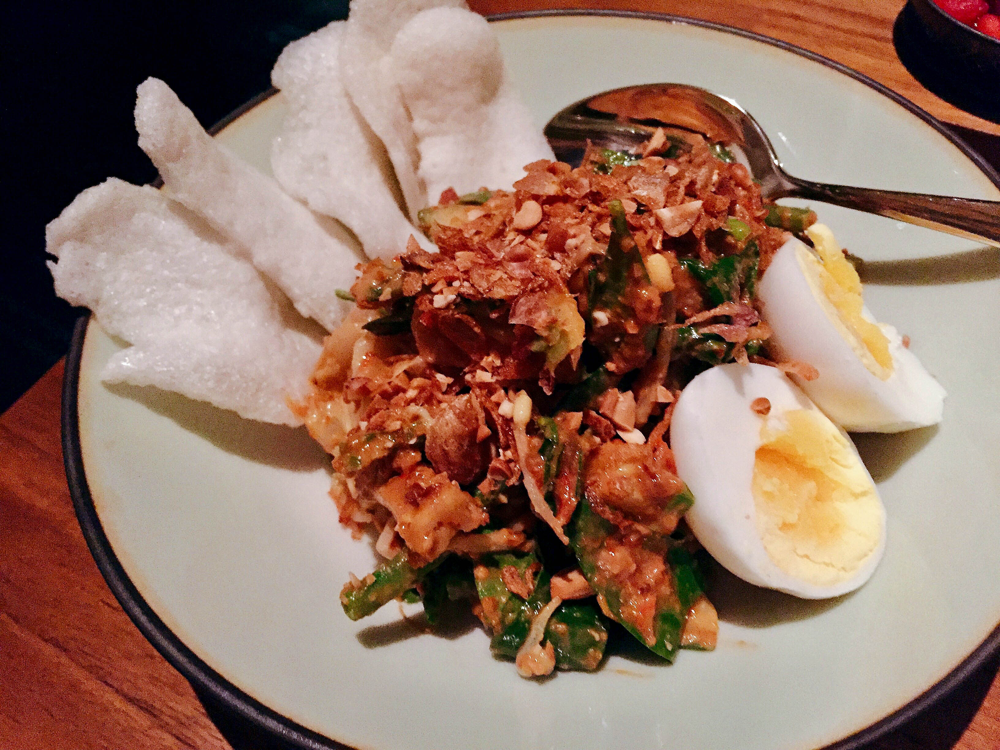

🇮🇩 **Seminyak, Bali, Indonesia**

**Address:** Jl. Petitenget 51B, Seminyak, Bali 83061, Indonesia  
**Telephone:** +62 (361) 300 7990  
**Opening Hours:** Mon-Sun   
12pm to 4pm, 5pm to Midnight  
**Recommendation:** ✩✩✩  
**Cost:** $$  
  
A here, I'll be guest blogging this entry since Kaum was my choice that day for for dinner. Named after the Indonesian word for "clan" or "tribe", Kaum is situated just above Potato Head Bali and provides a modern take on traditional Indonesian fare with an emphasis on authentic taste, locally sourced produce, and genuine flavors. The restaurant itself features concrete walls adorned with Torajan wood art, handcarved wooden tables, and bespoke ceramic tableware reflecting Indonesia's rich cultural heritage.

Diners have the option of sitting at the communal dining table, which spans the entirety of the restaurant and gives diners the opportunity to dine family-style.

One of our beautifully crafted cocktails courtesy of the lovely folks downstairs at the Potato Head. Sadly, I've forgotten the names, but I do remember them being super strong.​While traditional Indonesian cuisine features prominent spices and heavy flavors, Kaum's cuisine was exceptionally well executed that managed to avoid being too heavy. Be prepared to stay hydrated throughout the meal, as the food can be very spicy for those used to more mild cuisine.

Gado-Gado Kaum, the signature Kaum blanched vegetable salad with peanut sauce dressing served with garlic crackers, tofu, and free range eggs. 

**Header image credit:** [Kaum](https://kaum.com/)
