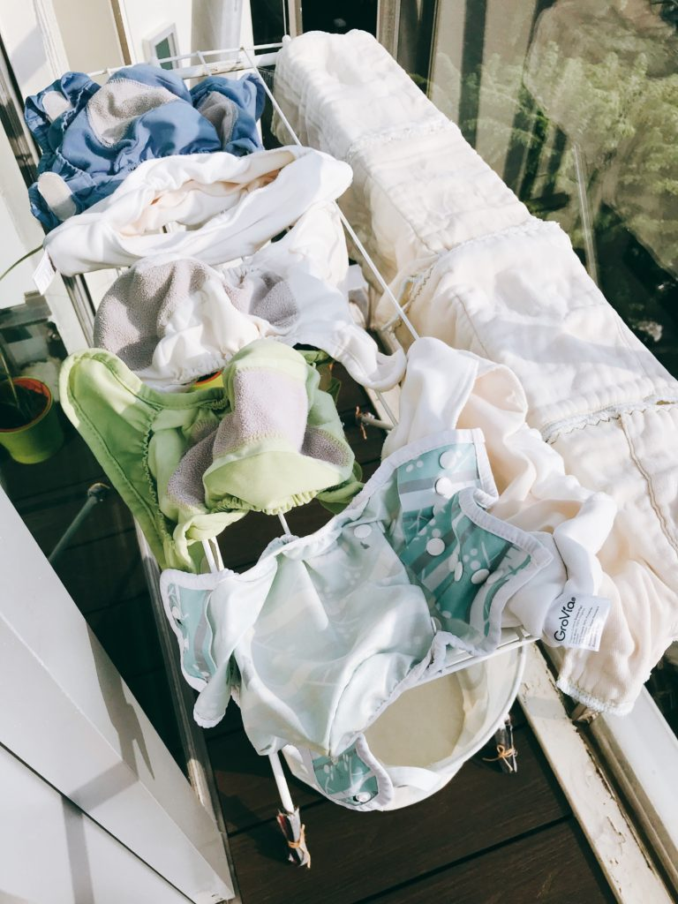

> **Type of laundry detergent:** Persil  
> **Cycle duration:** 3 hours- 30 min pre-wash and 2.5 hours of "soiled cycle"  
> **Good to have:** a cup of baking soda. Put this directly into the machine and not through the dispenser.   
> **Daily cycle**, washing 8 CD a day.   

Most cloth diapers (CD) would come with instructions on care and maintenance for the CDs. You can also google the instructions online. Pee is known as ammonia, which is a naturally generated waste from a human being. Great for fertilising the barren soil if you have a home garden. My grandma used to make my brother pee in her garden. 

## Can you use baby laundry detergent? 

No, it is not recommended to use baby laundry detergent. Most "free & clear" detergents do not generate enough suds to allow the ammonia in the CD to be removed. Over time, the ammonia will build up and may even result in ammonia burn for the baby's bottom. [Julian's drawer](https://jilliansdrawers.com/pages/washing-cloth-diapers) has a good table that shows the various detergents that can be causing a leak due to poorly washed CD/inadequate removal of stain because the detergent is not doing a good enough of a job.   

## What laundry detergent should I use?

You can experiment with various laundry detergent you have around the house. The sniff test is the best way to see if the CD is clean. Just put your nose real close to the CD and take a good sniff.  If your detergent is not working, meaning that the CD smells like pee, then you should [strip](https://www.clothdiaperkids.com/pages/how-to-strip-cloth-diapers) your CD. 

## Baking soda to the rescue

Baking soda on its own is great for laundry. It whitens yellowish shirts and prevents odour. I always put in a cup/spoon of baking soda in every laundry load (a tip from my father who washes the whitest bedsheets ever).Adjust the amount of baking soda according to Asian mom cooking standard which is usually estimated with eye power. 

Depending on where you live, your water can be "[hard](https://en.wikipedia.org/wiki/Hard_water)" with lots of calcium and magnesium inside of the water from pipes or water boiler. The best way to tell if you have hard water is by looking at your faucet. Does the water droplet leave a white ring behind once it is dry on the metal surface? If yes, then you have hard water. 

Hard water is bad for laundry because it causes soap not to foam. In order for things to be clean, the washing machine agitates the clothes to allow the detergent to bind to the dirt and create foam. The rinsing of the foam takes away the dirt, which is how you end up with clean laundry. 

Baking soda has mild alkali qualities to allow dirt and grease to dissolve during the laundry process. It "softens" the hard water, which helps your laundry to be cleaner. This is not some Pinterest hack that has no science backing. 

If you remember your high school chemistry... vinegar + baking soda = [volcano](https://www.thoughtco.com/equation-for-the-reaction-of-baking-soda-and-vinegar-604043). The carbon dioxide escapes the solution as bubbles. The bubbles are heavier than air, so the carbon dioxide collects at the surface of the container or overflows it. In a baking soda volcano, detergent usually is added to collect the gas and form bubbles that flow somewhat like lava down the side of the *volcano*.

When you have a CD full of pee + vinegar + baking soda + detergent, you can imagine that there are multiple volcanoes exploding inside of your washing machine. Ok, maybe not. But that is the beauty of chemistry at work there. I don't routinely add in vinegar unless the CD is super smelly. Baking soda is generally good enough for getting a good clean. 

## Is baking soda safe for cloth diaper?

Yes, it is not going to ruin your CD. Cleaner CD means it is less likely that the mould would grow and you would have to throw it away. CD is like underwear... and as a consumable, you will have to replace it at some point.

 Some people believe that bleaching the mouldy CD would get rid of the mould but that is not exactly true because mycelium from the mould is extremely hardy and although you might not be able to see the mould anymore on the surface... you might still have the mould hanging out on the CD (google black bread mould to see what I mean). 

## ☀️ eco-friendly way of drying your CD

In order to maximise the amount of the sun that my CD will get, I start my CD load at 5AM. By 8AM, my helper will put the CD outside to dry under the sun. We will then bring the CD back inside around 5PM (before the sunset). 

Drying CD under the sun will stiffen the fabric, but baby L does not mind it. CDs are lined with PUL and dryer is not too great for it. I never try to tumble dry thus far since sunshine is plenty in the tropics. 

Well, there you have it. You now understand the science behind washing CD. Go out there and be eco-friendly. Switch to CD today. 

BTW, don't feel guilty about using a disposable. I use it when we go out with baby L and there is nothing wrong with occasional convenience. 

**Header image credit:** Unsplash - [Annie Spratt](https://unsplash.com/photos/5TfCI4nj6B4)
