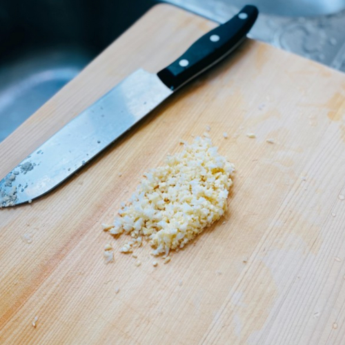
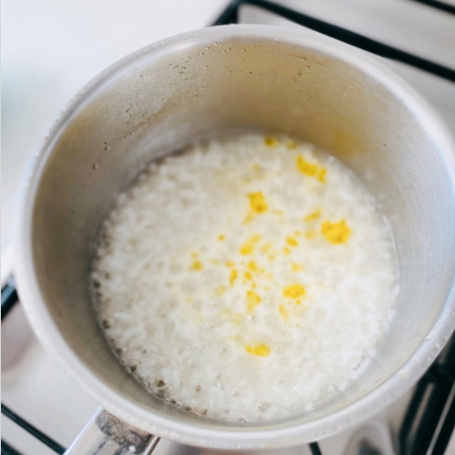
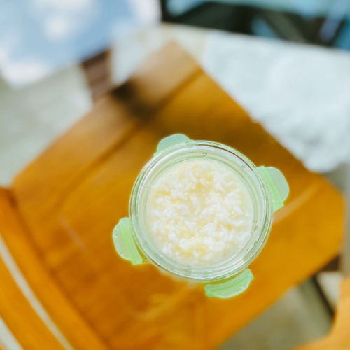

## How do You Know that Your Baby is Ready?

My mother said I started to eat apple sauce at the age of 4 months. By 6 months, I was already using a spoon on my own. I must be some kind of magical child...but that should not be the way to determine whether or not my own child is ready for solids. 

[Mayo Clinic](https://www.mayoclinic.org/healthy-lifestyle/infant-and-toddler-health/in-depth/healthy-baby/art-2004620) has a list of questions for parents to answer before starting solids. 

* Can your baby hold his or her head in a steady, upright position?
* Can your baby sit with support?
* Is your baby mouthing his or her hands or toys?
* Is your baby showing a desire for food by leaning forward and opening his or her mouth?

Baby L could hold up her head by month 4 and sat with support. She would finish her breastmilk in a bottle and sit next to us during dinner time in her baby chair. I noticed that she would reach out for food or try to grab my plate, so we decided that she was ready to start solids. We spent over 2 months with just 1 single breakfast meal while she continued with breastmilk. 

## Age 4-5 Months Feeding Schedule

>  **5:30AM:**    120ml-150ml  
>  **8:00AM:**   60ml     
>  **Breakfast:**    1 large tablespoon of baby cereal   
>  **11:00AM:**  120ml-150ml  
>  **3:00PM:**   120ml-150ml  
>  **5:30PM:**   120ml-150ml  
>  **9:30PM:**   120ml-150ml    

120ml ~4 oz;   
150ml ~5 oz;   
180ml ~6 oz  

## The Transition from Breastmilk to Cereal

Baby L started her soft diet when she was 4 months old with organic brown rice cereal (米糊). Initially, I would heat up some breastmilk to add into the cereal so baby L would eat it. I would still feed her breastmilk in a bottle with a few spoonfuls of breastmilk infused cereal. She eventually graduated to 1:2 cereal to hot water. She eats one large tablespoon of it every morning. 

## Porridge/ Baby Cereal Brands

We get **Only Organic Brown Rice or Banana Porridge/Baby Cereal** from NTUC Xtra (see below). It costs about ~$SGD7 and lasts about 30 days. It is made in Belgium. We tried another brand previously (**Holle Organic Milk Cereal with Spelt**) but Baby L had some perioral rashes after eating it. 

## Start Slow

We started with 1-2 spoonfuls of baby cereal because Baby L was not used to the baby spoon and was a bit of a messy eater. Over time, she improved and had minimal messiness during mealtime. It also makes more sense to train your baby with spoon eating first before you scale solid eating to all other mealtimes. Otherwise, you would spend a lot of time feeding her when she is not capable of swallowing at a reasonable speed. 

## Watch for Allergy

Given that Holle has whey as part of the ingredients, we believe that Baby L might be sensitive to the whey proteins but most babies [would outgrow their sensitivity](https://www.mayoclinic.org/diseases-conditions/milk-allergy/symptoms-causes/syc-20375101). Her rash would usually last about 1-2 hours and go away on its own. It was pretty mild. She never had severe symptoms like hives and swelling of the eyes or lips so we just switched brands temporarily and then finished the old box of Holle Organic Milk Cereal at a later date. 

You should observe your child 1-2 hours post mealtime to make sure that they are able to digest the food and there is no food allergy. I only started Baby L on solids for all 3 meals when my mother was in town so she could watch for allergic reactions during lunch and dinner time. 

## Solids for All 3 Meals

In order for her milk time to sync with adult mealtimes, we would increase the amount of milk and delay the next feed. This was to make our lives easier and so she would be able to eat at the dining table. 

We started by cutting down the 6 PM feed to 75ml and replacing it with 1 large tablespoon of porridge. This is the Chinese style of porridge with either a vegetable, chicken stock, or pork bone soup base. Carrots, cauliflower, corn, or seaweed are finely minced. Babies can't process salt so there is no salt, butter, or oil in her food. The porridge would be increased to 100ml then ~150ml. We measure the amount of porridge so we know how much we are giving her. Once she was on solids for dinner then we would do the same for lunch. 

## Age 6 Months Feeding Schedule

> **5:30AM:**   150ml  
> **8:00AM:**   Transition (see above)  
> **Breakfast:**    1 large tablespoon of baby cereal   
> **12:00PM:**  Transition (see above)  
> **3:00PM:**   150ml  
> **6:00PM:**   Transition (see above)  
> **9:30PM:**   150ml  

## What Kind of Spoon?

**Boon, Swap, 2-in-1 Feeding Spoons** are really awesome. I like to use the metal end to scrape apple into the bowl for Baby L and use the softer end to feed her. 

## Making Your Own Chinese Porridge for Babies
1. Mince baby corn and cauliflower finely. You can switch up the flavor by adding carrots or seaweed. 
2. You can switch up the flavor by adding carrots or seaweed.
3. Cook white rice in chicken soup stock for 30 min or until the soup stock is fully absorbed. Add in the finely minced vegetable. 
4. Here's a delicious meal for the baby. Full of nutrition and blah blah blah. 

**Header image credit:** Unsplash - [Thought Catalog](https://unsplash.com/@thoughtcatalog)
