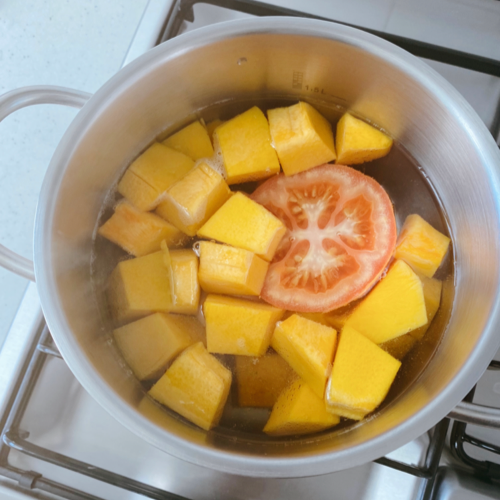
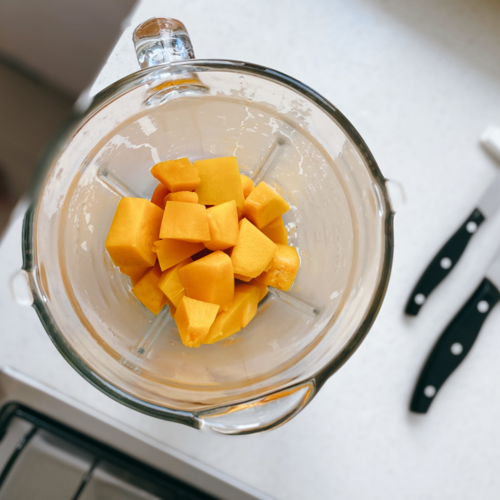
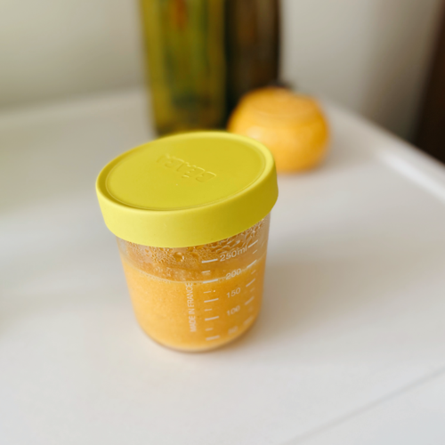

This is one of my favourite baby food meal for baby L. It is so easy to make and mess-free! You can add a soft-boiled egg if you want to make it more nutritious. Tomatoes are optional. 

1. Cut chunks of organic pumpkin and tomato in small pieces and boil them in the water.  
2. Drain the pumpkin and tomato and save some of the water for later. 
3. Put everything in a blender. Add some of the water from the pot to make the purée less dry.  
4. Remove the puree from the blender and you are done!

**Header image credit:** Unsplash - [Tijana Drndarski](https://unsplash.com/photos/RrF5wBMo9Xo)