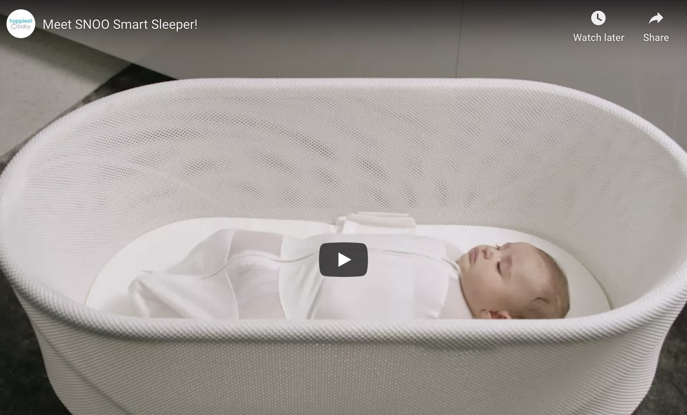
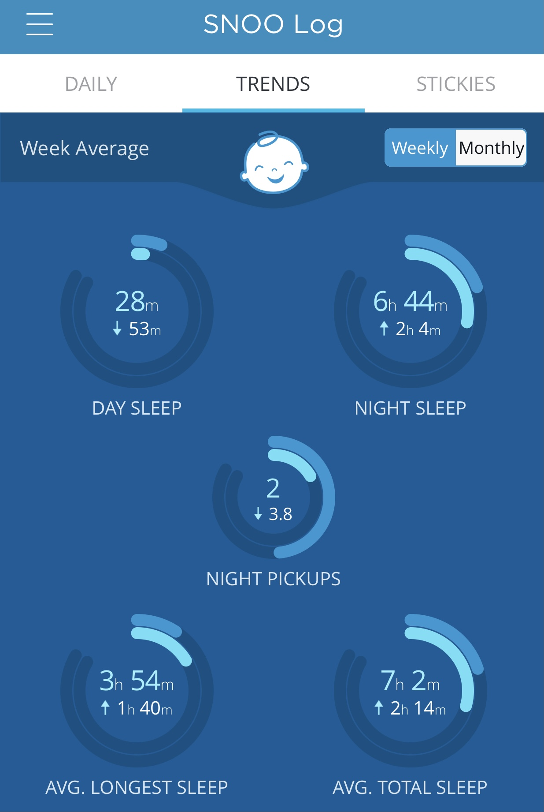

^ 👀 Watch that video to see how Snoo works

Are you a parent expecting a kid soon? A Snoo is the best Christmas gift you can give yourself and your spouse. A good night's sleep is critical to maintaining a loving relationship. 

I am a self-confessed b$%*# when I run on 4-5 hours of sleep. I know this from my days working in plastic surgery. I'm just not a fun person to be around when I get a call in the middle of the night from the ED after sleeping only 4 hours a few nights in a row. I knew I needed Snoo to maintain some sanity in my marriage. 

I didn't mind forgoing gourmet coffee for months just so that I could get some quality sleep in between the feeds. Not that I could drink coffee anyway while I was breastfeeding. Another serious consideration was the fact that my husband did overnight calls at least once a week and needed a lot of rest when he comes home. With Snoo, he was able to get the sleep he needed to recover for his work, given that the Snoo was parked next to me at night for easy breastfeeding for the first 2 months of baby L's life.

Newborns sleep a lot. They also cry a lot. They are fussy creatures that need extra amount of attention ALL THE TIME. Before you get the sticker shock, I get it... the Snoo is expensive! **$1,395 USD** is not something you just throw around for funsies but trust me the sleep is so worth it. I thought about getting the Finnish baby box for baby L's crib, but in the end I bit the bullet and bought a Snoo. I shipped it all the way from the US to Singapore because there was not a single supplier that would bring it over. 

To my pregnancy-hormone fueled brain, I almost planned a trip to Australia just so I could haul a Snoo back. What dissuaded me was the possibility of paying for an oversize luggage which would have been enough for shipping from the U.S.A. In the end, I managed to offset shipping costs with 15% off from buying it through my Amazon baby registry. 

If you do a quick math, there are 180 days in 6 months and babies typically need to sleep about 15-16 hours a day = 2,880 hours. 
$1395 / 2880 hours = 48 cents per hour, which is roughly $8 per day.

## Ahh that amazing sound of womb noises

When active, the Snoo emits low-grade ambient noise to mimic the sounds of the womb. This put both the bébé and me to sleep, which is so important! As a parent, you will sleep better with white noise. As a baby, you will also sleep like a rock for 6-8 hours a night. This is almost a miracle that no one has ever heard of for infants. 

## It comes with an app

If you are a data obsessed parent, you are in luck and you can see the week on week changes in number of hours slept and number of disruptions. 

 </a>

I did go through a phase of obsessing how much baby L slept, poo, and pee for the first 2 weeks with graphs and all, then I quickly got too tired to care. My husband still digiligently charted the input and output daily on a separate app call [**Glow Baby**](https://apps.apple.com/us/app/glow-baby-newborn-tracker-log/id1077177456). I moved on to charting the amount of breastmilk I was storing away in my mini freezer with [**Milk Stash**](https://apps.apple.com/us/app/milk-stash-breast-feeding-app/id1212315450). I felt like a real squirrel storing away nuts for the winter. In my case, I was storing milk away for the little one. 

## It automatically rocks the baby back to sleep

*Did I mention that you don't need to manually rock that Instagram-worthy, but impractical tripping hazard that is a bassinet?* Well, Snoo rocks your baby back to sleep in a horizontal fashion. The whole crib moves laterally back and forth until the baby cries no more. 

I don't know what it is with Asian parents and their superstitions. Both sets of grandparents complained a lot about Snoo's rocking. They were worried that the baby's brain would be misshapened or shaken until it became mush. I set a limit to how fast the rocking would go, which was level 2 instead of the normal level 4 to please everyone that was living with us temporarily to celebrate the bébé's arrival. 

## You get alerts on your phone when the baby is "awake"

Snoo is a good robot. 🤖 It tries to put the baby back to sleep but if it fails to do so then it will just give up all together and await human instructions. You will get an alert that your child is inconsolable and requires immediate assistance. Without fail, the baby was awake due to a wet nappy or being hangry in the middle of the night. Great job, Snoo. 

## My wishlist for Snoo

Non-tech saavy parents always have a gazillion feature requests, I am no exception. I want Snoo to:

* Feed my baby every 4 hours
* Burp the baby
* Change diapers
* Alert the grandparents to take turns to "watch" the baby
* Essentially raise the baby until 18 and hand it back to me as an adolescent

Just kidding! I think Snoo has a set of well curated features that do the job really well. It is meant to help babies gain independence in sleeping and I was able to achieve that within 2 months of delivery. Baby L was sleeping through the night in a separate room by week 6. That is pretty amazing. 

## SIDS prevention

SIDS is a parents' worst nightmare. My husband used to check on Baby L's breathing if she was napping outside in the living room because she likes to sleep on her stomach. Snoo prevents SIDS by strapping the child in burrito style. It prevented baby L from rolling around and getting her face stuck by the sides of the bassinet. 

## It is reusable

If you are going to have more than 1 kid, I would say Snoo is worth every penny. The resale value of a used Snoo in Singapore is pretty high. The gently used one that I saw on Caroussel was about $500 off of the original price and it got snatched up quickly before I could even get my hands on it. 

You know what is not reusable? Confinement nannies. Just thinking about getting the paperwork done for a second child gave the appropriate amount of push to go for something that will deliver same consistency all the time for the baby's sleep. Plus, out of my own selfish reasons... I did not want my baby to form a stronger bond with anyone else. 

**Header image credit:** Unsplash - [Paula Campos](https://unsplash.com/photos/Zf8mxi8sqTo)