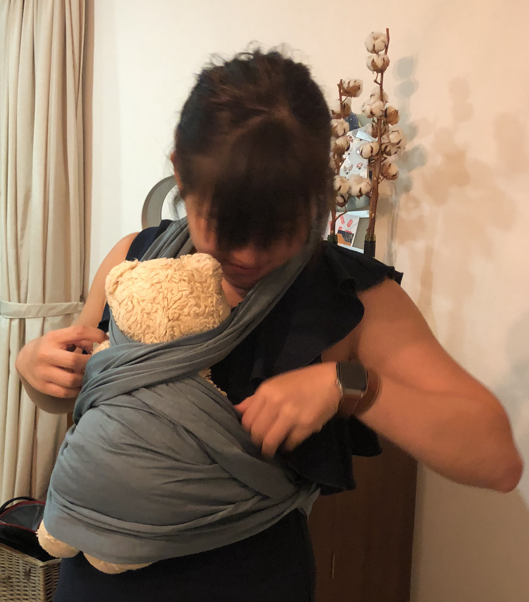

Baby carriers are a must if you want to free your hands from a tiny huummann that can't possibly walk on his or her own. The question is what kind of baby barrier (cough...Freudian slip) shall you use? 

| Name | Cost | Portability | Washability | Ergonomics |
| :--- | :---: | :----: | :----: | :----: | 
| Solly Baby Wrap| $65 USD | ⭐️⭐️⭐️⭐️⭐️ | ⭐️⭐️⭐️⭐️⭐️ | 💪💪 |
| Tula | $100-300 SGD | ⭐️⭐️⭐️ | ⭐️⭐️⭐️⭐️ | 💪💪💪💪💪 |
| ErgoBaby | $150-200 SGD | ⭐️⭐️⭐️⭐️ | ⭐️⭐️⭐️⭐️ | 💪💪💪 |

I was carried by my grandma on her back with a baby carrier that is like a long strip of silk. Most Asian countries have some form of babywearing tradition. She had a purple and a yellow cloth carrier that she would switch out daily. I would be on her back while she cooked for the entire family or boil water for baths. One of my fondest/earliest memories of my grandmother was her singing lullaby in Taiwanese while I gently sway from side to side on her back. She carried me all the way until I was about 2. 

  

## Considerations Before You Buy
Before you buy a baby carrier, you should talk to your partner about the patterns because at the end of the day it is a tool that both parents should feel comfortable wearing in the public. 

Be cognizant of height differences between your partner and you so choose the carrier based on your situation. 
I never thought I would get so many carriers so please don't get **carried** away by Black Friday Sales. #badpun

## Solly Baby
[🛒](https://shop.sollybaby.com/)

It is meant for a tiny bébé/ newborn. The only issue I had with this is that the fabric is lax and it becomes tiring for your back if you plan to carry the baby for > 45 minutes. Traditional Taiwanese baby carriers are made of soft/silky fabric that has higher ductility vs. the Solly Baby Wrap is stretchy so it comes loose after a while. Then your body would try to overcompensate the baby's position because you don't want to wake the baby up. Not really ergonomic for a carrier. 

The wrap patterns are cute and you can color-coordinate your outfit with the wrap but for the price point of $65... I would want something much more comfortable for prolonged babywearing. Solly baby sells cute crib sheets so I would get those instead of the baby wrap. 

This is a picture of me carrying a teddy bear with the Solly Baby Wrap. 

## Tula Baby
[🛒](https://babytula.com/)

Tula has a cult following for its baby carrier because it is comfortable for the wearer and there are many options to fit the kid. 
* Tula Lite (Compact Carrier) (12-30lbs; 5.4-13kg): This is a new product that allows you to fold your carrier into a waist pouch and you can go about your day without carrying an additional item. Great for parents on the go and want to be minimalistic when you go on a day trip. 
* Explore (6-in-1) (7-45lbs; 3-20kg): Explore is more expensive but highly versatile because you can carry the kid in 6 different positions. It supports both front and back carrying so I love this carrier. Another great variation of Explore is the **coast collection** which has a large mesh panel in the middle of the carrier. It is perfect for Singapore's hot and humid weather. I got one when it was on sale but because of COVID... my brother has yet to bring it back to Asia with him. Right now we are using a Signature Explore in ombre color. It is cute, stylish, and my husband does not mind wearing it. Goal accomplished. 
* Free-to-Grow (7-45lbs; 3-20kg): Like Explore, Free-to-Grow supports the same weight range. If you want to save money as a parent, you should consider Explore or Free-to-Grow. It is a front-wearing style with the baby's face facing your face. I know baby L would not like that because baby L always wants to see what is going on so we did not consider this carrier. Free-to-Grow is slighly more compact compare to Explore. 
* Standard (15-45lbs; 6.8-20kg): Good for >18 months and older wearing or big babies in general. My kid is like average size so I did not bother with this. 
* Toddler (25-60lbs; 11-27kg): I actually don't think kids need a carrier at this point but that is my own personal opinion. I would really hope kids that are like 11kg can walk already. 

Tula has big buckles and long straps for parents who are not flexible and can't clip the damn back clip themselves. My husband does it with one hand. I don't know how he does it. I don't know why baby carrier makers make the buckles so small. The last thing that parents want is to fuss with the buckles while the child is struggling to get out! More about that later. 

### What is a Signature drop?
The signature line is Tula's "most exclusive, limited-edition carriers, Tula Signature is a testament to the craftsmanship we value as a brand. Each carrier is thoughtfully designed, in collaboration with unique artists, using elegant woven fabric and sewn by one of our seamstresses in the town where Baby Tula began—Bialystok, Poland." It has great resale value. 
One of the used Tula that is in the signature range in the rainbow color that had additional dinosaur backplates on the hoodie was selling for $1500 on a Tula Facebook group. Because they are limited edition, they can fetch a good price after the baby no longer needs them. 

Moms go crazy over Tula customisation. There are many many Etsy shops (rabbit holes) that would match the fabric from the Signature drop and add things like the hood, fabric reach strap, additional mesh, and even pacifier clips. There is a huge mom community on [secondhand Tula](https://nypost.com/2016/08/27/meet-the-mom-cult-that-speaks-a-secret-language-and-wears-2500-baby-carriers/). I mean... that is how they got me too. I have 3 Tulas. 2 Explore and 1 ring slings. 

My personal fav is the signature ring sling because I don't have to unbuckle it when I put the kid to sleep. I can just gently remove the sling with the baby without making any velcro or buckle sounds. It has the right level of ductility and I don't get as tired wearing the baby for hours.

## Ergobaby
[🛒](https://ergobaby.com/)

Although the name is Ergobaby, I did not think the carrier was great for my back. I could feel the strain after prolonged wearing. The straps are much smaller compare to Tula so you get localised pressure from wearing the kid rather than a uniform distribution of the weight throughout the waist ban. 

Ergobaby, however, comes with an add-on for newborns. It is sort of like a seat that the newborn sits on while sitting in the carrier so the head can pop up. My husband always worried that he would crush baby L with the seat and Ergobaby so we did not have that great of an experience using this carrier. After mediocre satisfaction with Ergobaby for 8 months, we made the switch to Tula. I pretty much stopped using Ergobaby. 

## Conclusion

It depends on your babywearing habits and your lifestyle. If you do not wear the baby then you don't need a carrier. I prefer hands-free and not have to push the stroller everywhere and that is why a carrier is the transport of choice for my kid. 

**Header image credit:** Unsplash - [Siora Photography](https://unsplash.com/s/photos/fabric?utm_source=unsplash&amp;utm_medium=referral&amp;utm_content=creditCopyText)
