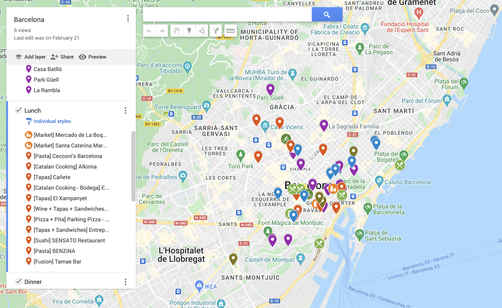
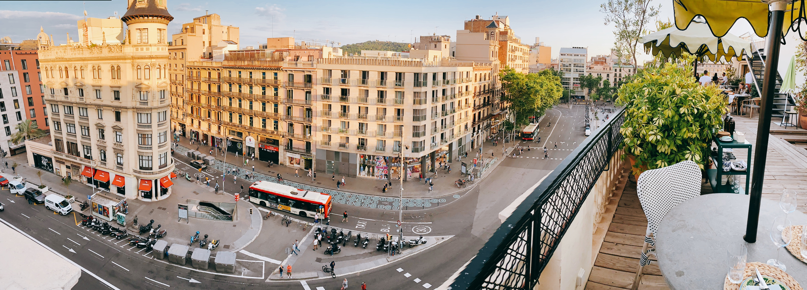
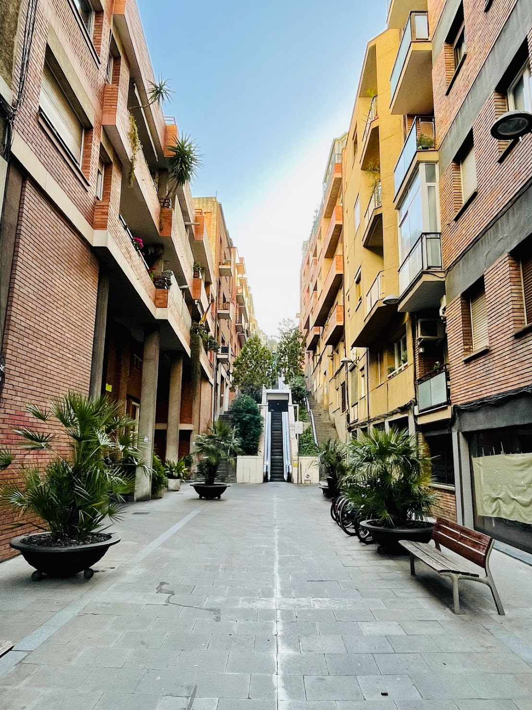
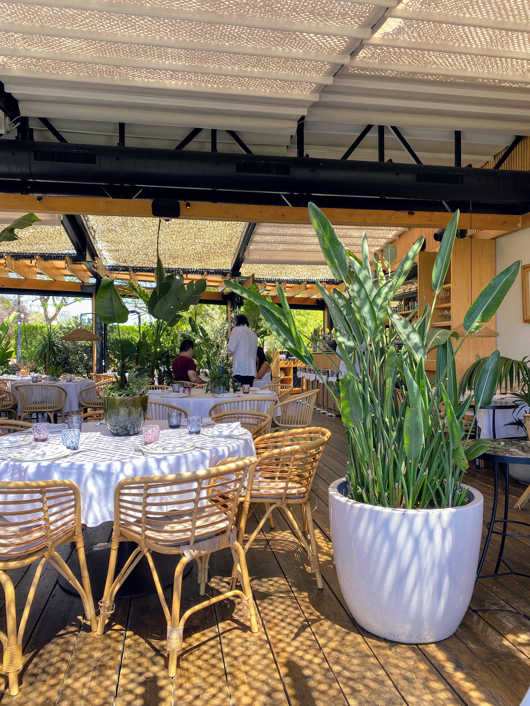

I was supposed to fly back to Boston for my MPH graduation at Harvard, but it would have taken 24 hours to get to the US and coordinating care for a toddler/being pregnant during a pandemic is not easy. We chose to take a family vacation together before I deliver another bebe.

We were in Maldive in Jan 2022 when the borders opened. Even though travelling with Toddler L on a 5-hour flight was a nightmare we decided to give it another go.

I wanted to live in Barcelona since high school. When we were learning about the La Pingüina that lives in Catalonia (some poem we had to recite in school), I was obsessed Barcelona. Always wanted to see Gaudí's work in person. Sadly to say, being a premed meant I did not continue my Spanish language education in college and never study abroad. 

Criteria for a family-friendly vacation is very different from our usual vacation:
1. A city that is walkable
2. Plenty of food options for picky eater
3. Amazing architecture (ok this one is more for me)
4. Good weather (Paris in November was not good weather)
5. Not too far in terms of timezone

## Planning Phase

I recently rediscovered Google Map's feature on pinning your location of interest. This helped a lot in the research phase to determine where we want to stay. 

Click on the map to see my Google Map

We ended up choosing a quaint little AirBnB studio that is in proximity of the Plaça de la Universitat. This is a great location to explore all the sites. It is relatively central but not as touristy as the Gothic quarters. The Aerobus will drop you off near the metro station and the Aerobus going back to the airport is a short 10 min walk away. 

I have to say the public transport in Barcelona is so much better than Paris. When I was pregnant with baby L, I went to Paris for a medical conference and the roads were under construction. We push our luggage for over 20 minutes to the Pasteur Institute where our AirBnB was located from the airport bus drop off area. 

## Packing for Barcelona

We had 1 suitcase to share among A, toddler L, and me. We packed light because the AirBnb was able to provide a washer and a dryer. 

Toddler L has been toilet trained, so we did not have to pack as many diapers. It is pretty easy to get diapers anyway because there are pharmacy and Aldi/Carrefour within walking distance to where we live. 

**Packing List**
- iPads loaded with movies and TV shows that are kid friendly for the long flight
- 3 sets of clothes for everyone
- Heavier jacket in case it gets cold (the coldest was around 20 degree)
- Some Asian snack for the hungry toddler
- Comfortable walking shoes and sandals
- Camera
- Triike
- 1 backpack that is lockable to prevent theft 
- 1 grocery bag for farmer's market shopping
- 1 Mommy carryall bag

My initial plan was to rent a bike for both A and me since Barcelona was a very bikeable city. You can check out [Kleta](https://www.kleta.com/en/). €19,80  per month for bike rental. It was the cheapest that I could find. Other places do hourly rental if you don't want to commit to renting for the entire week.

Make sure the place you are staying has an elevator that can fit your bike though. The AirBnB we stayed at had a tiny, old-fashioned elevator that fitted 1.5 people (0.5 = Toddler L) so it would have been difficult to manage the bike if we rented. You do see lots of people in the bike lane and almost everywhere has a place for people on bike to travel on the road while avoiding cars. 

## What about your stroller?
Although most places are relatively friendly for stroller, I would say pack a light stroller if you want to bring one. We bought a Triike because it was a lot lighter than the current stroller we had but the downside is that Toddler L could not nap in a Triike. Singapore is 6 hours ahead so we knew Toddler L would have jetlag. However, we did not think she would start dozing off around 11 AM so had to adjust our schedule to fit the napping.

## Places that are not stroller friendly
- Park Güell - Bring a baby carrier and be mentally prepared for the uphill climb
- Casa Batlló - Bring a baby carrier. They can store your stroller at the entrance. 
- La Sagrada Familia - Once you are inside, you can use a stroller, but there are plenty of stairs and it can get crowded

Museums are much better alternatives. MOCO had elevators, so it was easy for us to navigate that with Toddler L's Triike. 

## Do you need to know Spanish to book tickets?
No, Spain is very tourist friendly. Most sites don't need 

## Single flight from Singapore

We had a short layover in Milan for 1 hour for refueling, but it was the same flight. I don't necessarily recommend this flight for a toddler because Toddler L had a meltdown when she thought we arrived in Barcelona when in fact we were in Milan. She demanded to get off the airplane so it was a pretty tiring hour for us with an overnight flight.  

#tiredparents

## Child-friendly itinerary

### Day 1
- 9AM: Arrive in Barcelona, got SIM card at the airport from Vodafone (level 1)
- 9:30AM: Get on [Aerobus](https://www.barcelona.com/barcelona_tickets/aerobus_barcelona). We got 2 way tickets. Keep the QR code receipt for the return trip. It takes about 30 min to get to the city. 
- 10:30AM: Checked-in and unpacked at AirBnB
- 11AM: Mercado de La Boqueria. You can get lots fresh veggies and fruits in this market. We got chorizo and fried seafood. Fried seafood are probably better if you can bring it home and heat it up. We were hungry and just ate it on the spot. 
- 12PM: Went to Carrefour to buy ingredients for breakfast and dinner
- 1PM: Nap time for everyone
- 8PM: [Restaurante Casa Luz](https://www.instagram.com/casaluzrestaurante/?hl=en)

We save a lot of money by making breakfast at our AirBnB. There are Carrefour organic brands for milk and artisanal yogurt. Just look for the "Bio" label. 

### Day 2
- 5AM: Toddler L woke up feeling hungry. I made huevos rancheros for A. 
- 8AM: Walk to La Familia Sagrada
- 9AM - 11AM: La Familia Sagrada. You probably need 1 hour to explore the cathedral. If you are an architecture enthusiast, you can spend a long time in the building. We did not go up to the towers because you have to walk down a narrow stairway which is not that child-friendly. 
- 12PM: Toddler L fell asleep. We found a cafe in Casa Milà, which apparently inspire Star War's buildings
- 1PM: [Tamae Bar](https://tamaebar.com/)
- 2-5PM: Some shopping at Zara Home. They have cute stuff for kids. 

### Day 3
- 6AM: Toddler L woke up hungry
- 8AM: Took the metro to **Vallcarca** and took the escalator up to Park Güell.
- 9:30-11AM: Park Güell. We walked down from the top entrance down to the dragon staircase. You can check out the Gaudí museum inside of the park. I would say go early rather than in the afternoon.  

- 12PM: Toddler L was napping on the baby carrier and we bought enchilada for lunch
- 2-7PM: Randomly decided to go outlet shopping. [La Roca Village](https://www.thebicestercollection.com/la-roca-village/en)is child friendly. There is a playground for kids to run around and plenty to do for adults wanting to get a good bargain. We took the [bus](https://www.sagales.com/en/trip/10/la-roca-del-valles-shopping-bus) there. The bus leaves from Estació del Nord, which is on the red line for the metro. You can purchase the ticket on board.

### Day 4
- 5:30AM: Toddler L woke up hungry
- 10AM: [MOCO](https://mocomuseum.com/locations/moco-barcelona)
- 1PM: [Cañete](https://barcanete.com/en/) for lunch
- 2PM: Nap time

### Day 5
- 6AM: Toddler L woke up feeling sick
- 10AM: [Casa Batlló](https://www.casabatllo.es/en/)
- 12:30PM:Ciutat Comtal for lunch
- 1PM: Nap time
- 8PM: Bought paracetamol from nearby pharmacy for Toddler L

### Day 6
- 6AM: Toddler L woke up having fever
- 8AM: Grab coffee at Nomad Coffee; Had a gelato
- 11AM: Took a nap
- 1PM: Terraza Martinez

- 2PM: Telefèric de Montjuïc/Barcelona Cable Car
- 4PM: Nap time

### Day 7
- 6AM: Breakfast at AirBnB
- 8AM: Aerobus to the airport. Get there early if you want to get tax refund. 

## Summary
It was a relaxing trip despite Toddler L being sick for a few days. Don't pack the schedule to the max. Have lots of downtime for the toddler to get adjusted to the new environment. 

**Header image credit:** Unsplash - [Florian Wehde](https://unsplash.com/@florianwehde)
