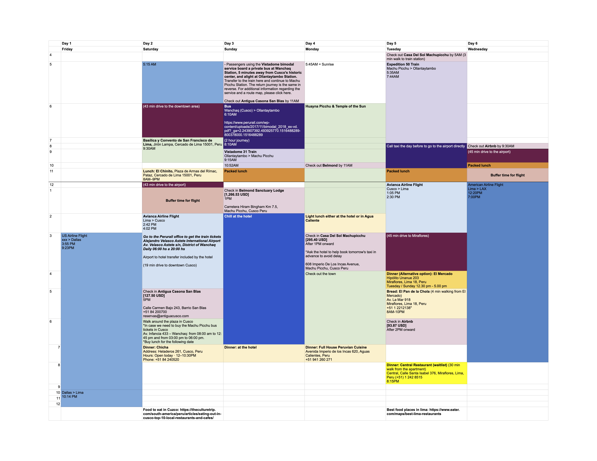
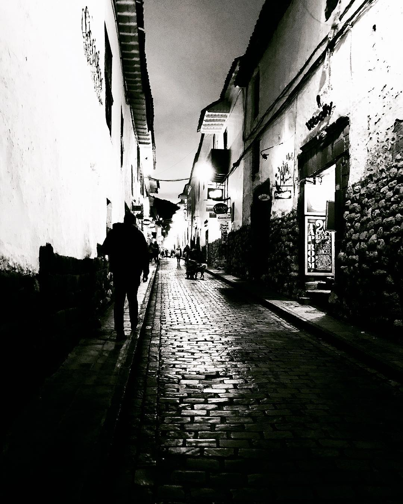
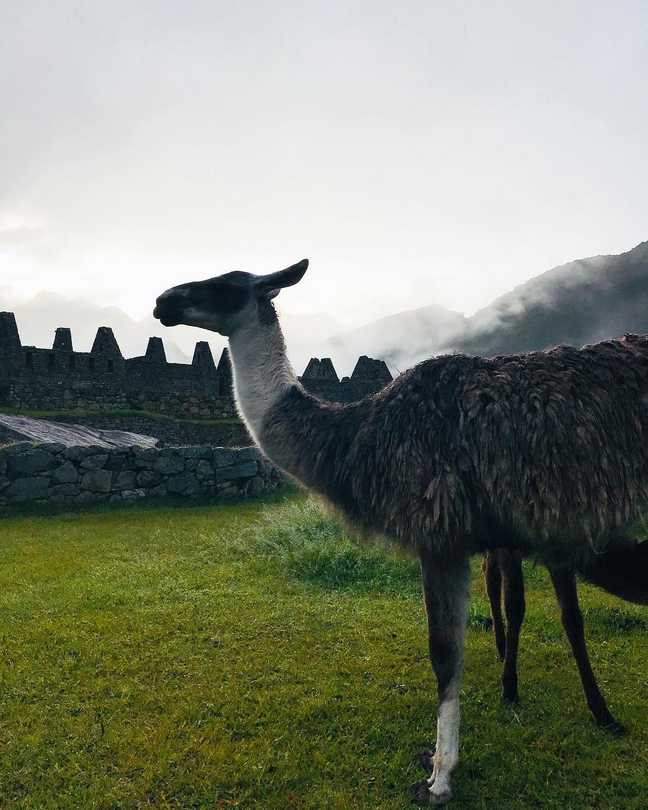
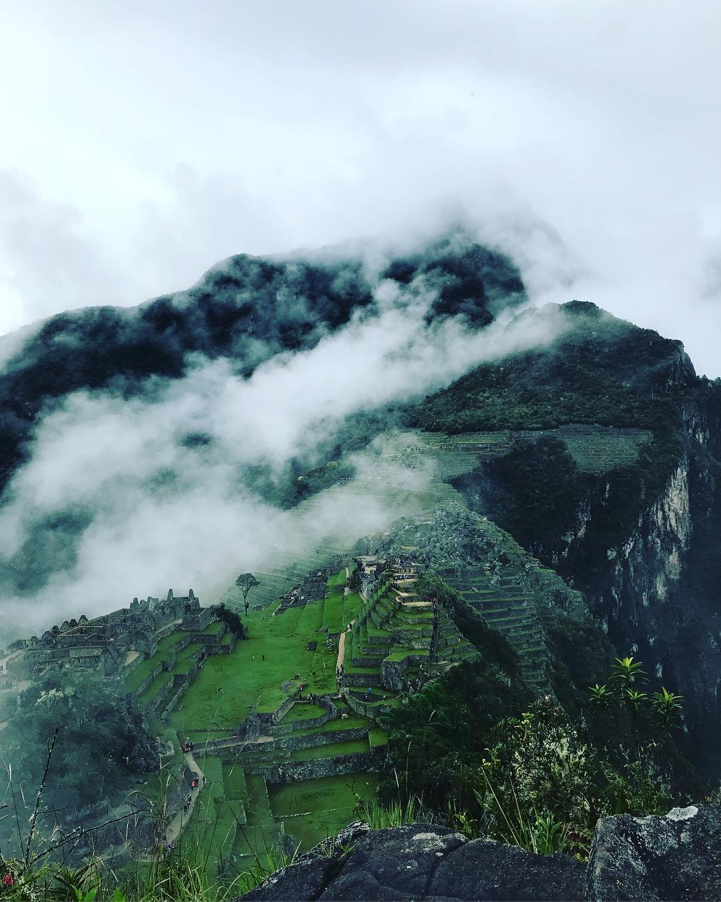

People always like travelling with me because I am an OCD planner. Excel is my best friend for planning trips. To date, I have not found anything better for planning trips than Google Maps. This was our actual schedule for Peru (as shown below). A and I saved up to go to Machu Picchu. We always wanted to go, so we took the opportunity when we were in California for a few months in 2018... which seems like eons ago.  

## Packing for Peru

This is the lightest that I have ever packed for a week-long trip. 

A single backpack for each of us: 
- **Raincoat**: You never know when it will start to rain in Machu Picchu. 
- **Basic toiletry**
- **Athleisure tights x 3**
- **Tops x 3**
- **Windbreaker x 1**
- **Shower shoes**
- **Socks x 3**
- **Tennis shoes**
- **Canon DSRL**: The camera that A won from an AirBnB photo contest. 

## Multiple flight transfers

We almost missed our flight from Dallas to Lima. I was not pleased with the US airline. They told us our flight was going to be delayed and there was nothing they could do about it. I mean I always knew that airlines based in the US had shitty customer service, but this was another level. There was no refund offered and no alternative routes for us to get there. The rest of our Peru trip hinged on that the first flight being on time. We could have very well have not been able to make the remaining parts of our trip. 

Long story short... we had to run from one end of the airport to the other in Dallas, which is a big AF airport by the way, to make it to Lima. It was an adrenaline rush start for the trip. 

We had a long layover in Lima before our afternoon flight to Cusco, so we went to the city center to get some chicharrón sandwich, which was so juicy and delicious. 

## El Chinito

El Chinito is basically a chain that sells Lima-style sandwiches. There was a queue before it opened. I did not see any tourists there other than us, so you can bet that the food is good. 

Ordering in Spanish truly put my high school education to the test. I took Spanish in high school but just never used much of it after I moved to Asia. Just go with **Sánguche de Chicharrón**. There are other combos but we just went with the sandwich á la carte. 

After breakfast, we walked around to check out the Basilica y Convento de San Francisco de Lima. Neither A and I are religious so we did not go inside. Just walked around and hopped on an Uber back to the airport so we can catch our flight to Cusco.  

## Lima to Cusco
The flight was only 1.5 hour long. Perurail's office is at the international airport so remember to pick up tickets before your flight. 

I would highly recommend asking the hotel to pick you up in Cusco. We lived around 20 min away from the airport, but Cusco has a lot of hills and is 3,400 meters (or 11,152 feet) above sea level. Altitude sickness is pretty much guaranteed. I would say minimize any exertion and definitely do not drink alcohol while you are there.

Before dinner we were like... wow I guess no altitude sickness for us... and we were wrong. We made the mistake of indulging in a little bit too much alcohol in Cusco. We thought it was fine to drink one glass of tropical cocktail after dinner. No, it was not. The walk back to the hotel (10 mins) was sooooo difficult. The air was so thin and you just feel like 💩. 

Till this date, I do not know how I managed to climb back onto that bed and call my boss at the time remotely/half-way across the world in Singapore while feeling like the air was so thin. 

It was an early night for A and me. We pretty much were out the moment we got back to the hotel. 

Other than the altitude sickness saga, we had a pleasant dinner at **Chicha** eating llama meat. The diner is close to the plaza where you can catch the sunset. Because there is so little light pollution, you can see stars.

Btw, llama meat kind of tasted like beef. Not too bad. Highly recommend the drinks if you are sticking around Cusco for a few days. Just don't drink on the first day you get there. 

## Wanchad (Cusco) to Ollantavtambo
We had to wake up at 5AM so we could catch a 2-hour private bus ride that will take us to Ollantavtambo. That is the start of the train ride to Machu Picchu. 

Pee before you go. Don't expect the bus driver to stop because there is no place to stop during the whole trip. There were no streetlights, and I am pretty sure we were driving near the edge of the road most of the time.

If you decide to travel via Perurail, you have to buy **Vistadome** tickets. There are large windows for you to see the Sacred Valley. Each of the cars features panoramic windows.

**Image credit:** Perurail

They played traditional Peruvian music on train and served you chocolate and coca tea. Coca leaf contains alkaloids, which is the source for cocaine. Those who live in the Andes drink the tea to combat altitude sickness. Interestingly, Coca Cola used to use decocainized coca leaf as its original secret ingredients. Coca leaf is a stimulant. It is better than a cup of coffee, but I still prefer the smell of the latte in the morning. Anyway, just drink coca tea there and don't bring it home because it is technically illegal to bring coca leaf into the States. 

Peruvian chocolates are really great souvenirs. I bought a bunch but did not give them out. I ended up eating them myself. 

## Aguas Calientes to Machu Picchu 
The train drops you off at **Aguas Calientes**.

Here you can decide if altitude sickness is too much for you. It was certainly too much for A and me. We took a 30 min bus up the mountain to our hotel. I won't quote the prices here because I am sure COVID has changed all these pricing and what happened in 2018 is probably not relevant anymore. 

Most people stay in Aguas Calientes and go up to Machu Picchu when it opens. We decided to splurge and not wake up butt early at 3AM to get to Machu Picchu. 

Btw you should book your Machu Picchu ticket wayyyy in advance. There are like hordes of people at 5:30AM lining up at the gates. We got the Machu Picchu + Huayna Picchu tickets so we can climb Huayna Picchu.

Again, we overestimated our stamina. 

The walk (climb) from Aguas Calientes to Machu Picchu would take you about 2 hours. We saw lots of backpackers walking up the mountain but I was like nah. No thank you. It just rained and it did not seem like a pleasant walk up the steep steep mountain. 

## Belmond Sanctuary Lodge

**Image credit:** Belmond Sanctuary Lodge

This is the only hotel that is outside of Machu Picchu. The downside is that it is a splurge. We pretty much saved for a few months so we can splurge on this. A was like we are not waking up at 3 AM to get into Machu Picchu so we chose sleep. 

> Sitting in the shadows of the Lost City, our lodge is an oasis of calm before or after a day exploring Machu Picchu. Unwind with a yoga session, take part in a traditional shaman ceremony in the garden, or sip muña tea in Tampu Bar. Tranquility, wonder and beauty are at the heart of our unique experience.

We did not do yoga session or the shaman ceremony. We literally just stayed there for 1 night so we can:

1. Get to the gates before everyone else does
2. Take a warm shower after we finish climbing Huayna Picchu 

This was the best decision we made on our Peru trip. 

After we got there via our tiny mountain bus, we chilled at the lounge while they served us our welcome drink and had a lovely alcohol-free dinner at the lodge. We saw Dave Chappelle at the bar but decided that we were just going to ignore him and enjoy the peace and quiet before the butt early hike up the historical site. 

## Machu Picchu vs. Me

Oh I ran... I was one of the first few that ran towards the Machu Picchu once they opened. However, it was misty... and raining... and you could only see like your fingers.

Thank goodness for raincoats. We pretty much slowed down once we climbed like 5 steps up the staircase. I know... aren't you a fit young woman in your late twenties? I was and I would tell you that altitude sickness was not a joke. 

A and I quickly gave up trying to be the first going up Huayna Picchu. 

Eventually the mist cleared away and you could see the ruins and the wild llamas that live there.

## Huayna Picchu vs. Me

We climbed the wrong thing. I am pretty sure we did. We lagged behind others and found a sign that looked like Huayna Picchu and just went up.

It turned out the picture that we got was way better than Huayna Picchu because it was not so far away. 

During the climb, we were like there is nobody here... and just kept climbing and climbing until we saw more rocks and were so close to the edge of doom. In some sections, we had to use both of our hands and feet. This is not a climb for the elderly. 

A does not do well with heights but because he wanted to protect me he climbed all the way to the top... where there is no safety rail to get this picture. I cut myself on a sharp rock and try to wash the wound with my water. It turned out I brought sparkling water with me... what a comical end to a scary climb. Pssssst with the water bursting everywhere 💦.

We were at the top with very little space to move around but captured this amazing picture of the mist clearing away from the rest of the Machu Picchu.

We sat in silence for like 5 min and was like ok... let's get down. If we die here... no one will know. 

On the way back, A was like if we break a bone (his orthopedic tendencies) then they are going to have a hard time air lifting us out of here. No one will be able to find us!!!

DO NOT LOOK DOWN! 🏔 You can't see the bottom. 

## Warm Shower

We got out of Machu Picchu before the rest of the tourists arrived by bus. I still remember we were in and out within 3 hours. DO NOT walk in the mist. Once the mist cleared, we were like shi#$#@... this stairway led to the edge of the cliff. There were plenty of those doorways that looked fine until you looked down. 

A and I took a warm shower and checked out of Belmond Lodge and got on the bus to Aguas Calientes. I guess that is why they called it a sanctuary...

## Aguas Calientes

This is a tourist town. Food is meh and things can be expensive. Save all of your shopping in Lima. 

We booked a hotel by the river. The bathroom was very meh but it is what it is when you are in a touristy area. 

We slept early. The next morning's train was at 5:35 AM. On the way back we took the Expedition Train. There was like no one on the train except us. No Coca tea this time. 

Remember that we had a private bus on the way coming to Ollantavtambo? There was no private bus on the way back to Cusco.

We asked our hotel staff to book a taxi that waited for us at the Ollantavtambo train station, so we could go to Cusco's airport directly. 

It was a nice drive through the Sacred Valley. The taxi driver rolled the windows down and we saw beautiful clouds and greenery everywhere. 

I would say budget more than 3 hours for the Taxi to get to Cusco to be safe. We found a wonderful café that made fresh pasta before our flight. Thank goodness that our taxi driver was ok leaving us to grab lunch and then drove us to the airport. He was like whatever just text me when you guys are done. 

## Miraflores, Lima

We stayed at an AirBnB for the last part of our trip. It was much more affordable compared to our hotels. We were waitlisted for **Central** (Netflix's Chef's Table) so in the end we went to [Rafael](http://www.rafaelosterling.pe/es/lima.html). It was tucked away in a busy part of the town. 

The bread was really really good. The cuisine was a mixture of Peruvian, Mediterranean, and Asian influences. We had their pastas and ceviche. It was hands down the best dinner that we had during our trip. We had wine pairing and would strongly recommend it. 

We did not eat at all of our bucket list, but we did pack **Sánguche de Chicharrón** to go on our flight back home. 

I think I had **Sánguche de Chicharrón** three times on this trip. It was simply the cheapest and best quick bite you can snack on after a long day of travel. Till this date, I cannot find better chicharrón than the ones I had in Lima. 

I don't think I would go back to Machu Picchu but Lima is a food heaven and you should visit this lovely coastal city if you get the chance. 

**Header image credit:** Unsplash - [Gabriel Rojas](https://unsplash.com/@gabrielrojas)