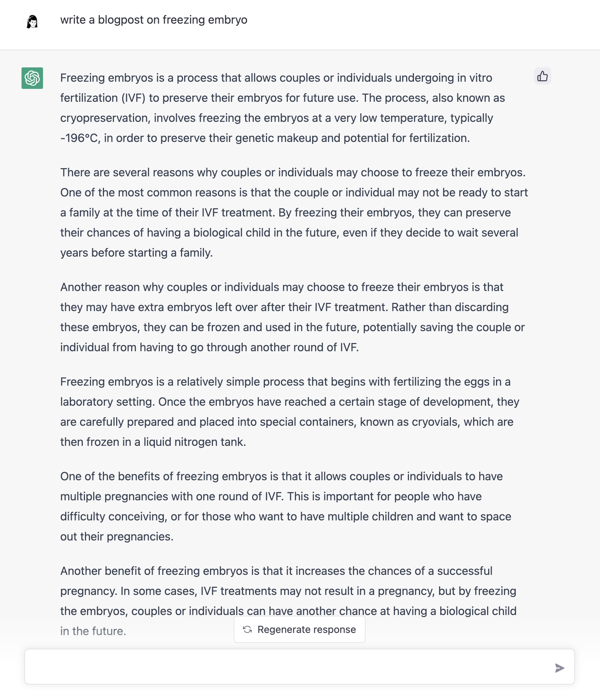

## What ChatGPT knows about freezing embryo
Freezing embryos is a process that allows couples or individuals undergoing in vitro fertilization (IVF) to preserve their embryos for future use. The process, also known as cryopreservation, involves freezing the embryos at a very low temperature, typically -196°C, in order to preserve their genetic makeup and potential for fertilization.

There are several reasons why couples or individuals may choose to freeze their embryos. One of the most common reasons is that the couple or individual may not be ready to start a family at the time of their IVF treatment. By freezing their embryos, they can preserve their chances of having a biological child in the future, even if they decide to wait several years before starting a family.

Another reason why couples or individuals may choose to freeze their embryos is that they may have extra embryos left over after their IVF treatment. Rather than discarding these embryos, they can be frozen and used in the future, potentially saving the couple or individual from having to go through another round of IVF.

Freezing embryos is a relatively simple process that begins with fertilizing the eggs in a laboratory setting. Once the embryos have reached a certain stage of development, they are carefully prepared and placed into special containers, known as **cryovials**, which are then frozen in a liquid nitrogen tank.

Overall, freezing embryos is a safe and effective way for couples or individuals to preserve their chances of having a biological child in the future. With advances in technology, the success rates of pregnancies from frozen embryos are now similar to those of fresh embryos. It is important for couples or individuals to discuss the option of freezing embryos with their doctor and fertility clinic to understand the process and benefits before making a decision.

## Here's my story
I have 2 beautiful kids but I also work full-time with a new job that will require plenty of travels in the region. Typically you should still have sufficient amount of healthy eggs before the age of 35 so it is recommended to extract oocytes for cryopreservation in order to boost the chances of IVF down the road. The quality of the oocytes dwindles with age and eventually these eggs that were there when you were a baby inside of your mother's womb shrivel up and die, aka menopause.

Freezing my eggs is my insurance policy. I would like to have more kids but just NOT now. I gave birth to my second child in the middle of 2022 and I am still recovering from the 4 hour sleep cycle. The whole pregnancy and pumping strained my aging body so much that I am not mentally ready to have another one in two years. I don't miss hemorrhoids that made sitting a huge pain and elephant calves from bilateral lower limb swelling. Pregnancy was not glam the second time around. The only thing I slightly miss is the 15 min short Netflix break that I would get from pumping Q4Hourly. The solitude of no one (kid) disturbing me while my body squeeze out milk to feed my youngling. 

Heck my epidural did not even kick in by the time I was ready to give birth. My cervix thinned and stretched at such a rapid rate (10cm opening over 2 hours) that no amount of epidural eased that pain. It was literally like someone pulling and stretching your cervix brutally... except that someone is your baby.

## Hush hush culture
People don't talk about infertility, surrogates, or even freezing their eggs. In my experience as the unofficial in-house doctor at the workplace, I get approached by colleagues who have been trying for kids for a year or friends who don't know who to ask to get help. 

Women who have yet to find a significant other worry about their fertility and the amount of money they have to make in order to have a kid. That is why I am sharing my story hoping that it would help someone having control over her body and how she would want kids. You should never feel ashamed of your ambition of wanting to have a successful career. 

## Premature aging
I honestly have to say that I was shocked that I had premature aging and had below average amount of oocytes left when they checked but then again this should not come as a surprise as have been a workaholic for years. High stress and high output job does take a toll on the body despite how I feel mentally.  

## Cost
Tech companies in Asia don't sponsor you to freeze your eggs but the cost of freezing/storing your egg or embryo is not as crazy here. 

**Cost of freezing my eggs in the US**
|  Line Item | Cost (SGD)    | Notes                                                        |
|:----------:|---------|----------------------------------------------------------------|
|  Treatment | $14.5K |     Includes monitoring, egg retrieval, anesthesia & other     |
| Medication | $6.6K |   Will vary depending on how aggressive patient is stimulated  |
|   Storage  |  $2.6K | Presume 5 years of storage, 1st year free, $500 per year after |
**Source**: FertilityIQ

**Cost of freezing my eggs in Taiwan**
|  Line Item | Cost (SGD)  | Notes                                                       |
|:----------:|-------------|-------------------------------------------------------------|
|  Treatment |    $3K-4K   |    Includes monitoring, egg retrieval, anesthesia & other   |
| Medication | $1.3K-1.75K | Will vary depending on how aggressive patient is stimulated |
|   Storage  |     $1K     |                5 year storage, $200 per year                |

Having that option of IVF down the road is something that I think is worth paying for. In the end, I chose to freeze embryo instead of eggs as embryos have higher probability of success for implantation. 

## Miscellaneous thoughts

I am often amazed by my colleagues who took years off to be a full-time mom but found the courage and tenacity to come back to the workforce once their kids are older. I am scare to take that leap. I don't want to be irrelevant. I don't have an old boys club to count on in a decade's time who will take me in despite having an empty CV for 10 years. 

I read Pamela Stone's **Opting out? Why Women really quit careers and head home** just before I gave birth and had an ah ha moment. 

*Marina Isherwood, a former executive in the health care industry, with children in the second and fourth grades, became convinced that caregivers could not replace her own parental influence:*

*There isn’t a substitute, no matter how good the childcare. When they’re little, the fact that someone else is doing the stuff with them is fine. It wasn’t the part that I loved anyway. But when they start asking you questions about values, you don’t want your babysitter telling them. ... Our children come home, and they have all this homework to do, and piano lessons and this and this, and it’s all a complicated schedule. And, yes, you could get an au pair to do that, to balance it all, but they’re not going to necessarily teach you how to think about math. Or help you come up with mnemonic devices to memorize all of the countries in Spain or whatever.*

*Because academic credentials were so important to these women’s (and their husband’s) career opportunities, formal schooling was a critical factor in their decisions to quit.* 

The jury is still out on how I feel about parenthood but for now it is all work no play. 

**Header image credit:** Unsplash - [Pawel Czerwinski](https://unsplash.com/@pawel_czerwinski)