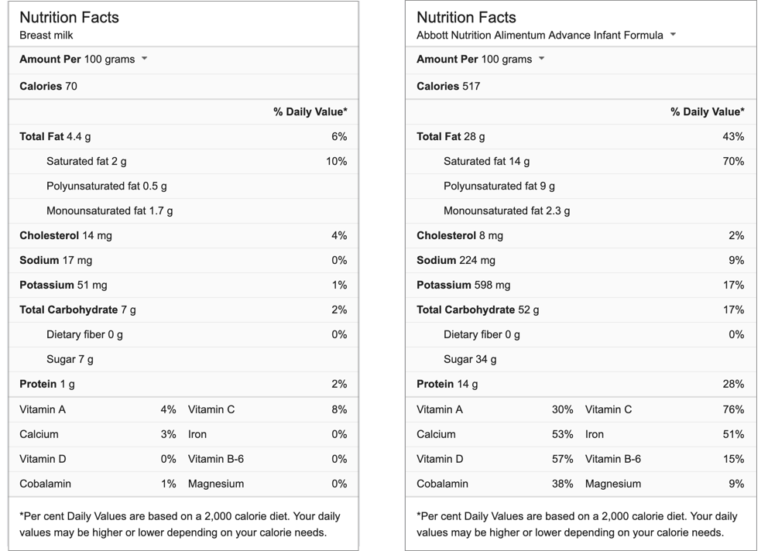

Breast milk is awesome because it has a cardiovascular protective effect for the mom (meaning less likely for mom's to get heart attacks from reducing the risk of getting high blood pressure, high cholesterols, and diabetes)... reduce breast cancer risk... and even lower the risk for babies to be overweight or have asthma. These are well known and well-established facts that have been studied from [BMJ](https://www.ncbi.nlm.nih.gov/pmc/articles/PMC2323059/). 

## The Cultural Significance of Baby Formula

When I was a baby, formula was all the rage. It was seen as the way to liberate mothers from home and allowed women from all over the world to return to work. It was seen as a tool for female empowerment. The emerging middle-class women in the 1980s loved the fact that baby-rearing was no longer a task for mothers only. Husbands could and did prepare milk for the babies. My father was one of those many fathers who took on more of the baby duties when I was growing up. 

## Were You Breastfed as a Baby?

Yes and no... my mother did a mixture of breast and bottle feed when I was a baby for the first 6 months. Subsequently, she did not bother much for the rest of my siblings. Like I said, formula was all the rage. Social circumstances at that time made sense for women to formula-feed their kid. My husband was formula-fed and he turned out just fine. 

## The Shift Back to All Natural Again

In the early 2000s, WHO began to push to increase exclusive breastfeeding in the first six months. The reasoning was simple. Women in the developing world oftentimes lack the resources to provide an adequate amount of nutrition to the baby (aka not enough food to eat). Malnourished babies would die early. Breastfeeding was free. Breastfeeding had real medical benefits. It was the best solution to reduce infant mortality rates around the world. 

Mainstream media picked up the trend and celebrities began promoting the "all-natural" diet for babies. The rich and wealthy women had the means to breastfeed their babies because they were not working. You ended up with the phenomenon that the target audience... which were the working mothers... still continue to formula-feed their kids... while the yoga moms who go on social dates during the day could breastfeed their children simply because they had the time. 

## Fast Forward to 2018

Breastfeeding is a public health issue. While WHO is trying to push more mothers to breastfeed their kids, [Trump](https://www.nytimes.com/2018/07/08/health/world-health-breastfeeding-ecuador-trump.html) decided that it was a 👎. This was the result of formula companies lobbying. As the baby formula market size shrunk from WHO's strong push for mothers to breastfeed, baby-formula companies have become more aggressive in terms of their marketing. They would provide free samples for mothers to try. Babies would tend to prefer to be bottled-fed with formula milk because (1) it requires less effort for sucking and (2) formula milk is slightly sweeter. Mothers would then lose the window to breastfeed once they start using the samples of formula milk provided by the baby-formula companies. 

[WHO's](https://www.who.int/nutrition/global-target-2025/i[nfographic_breastfeeding.pdf?ua=1) recommendation is to exclusively breastfeed for the for 6 months of the baby's life for the reasons stated above. 

## Is Formula Evil?

No, formula is not evil. [Promoting that "Breast is Best" is, in fact, damaging](https://blogs.bmj.com/medical-ethics/2018/08/22/harms-of-formula-vs-benefits-of-breastfeeding-why-we-dont-know-how-to-talk-about-the-effects-of-different-ways-of-feeding-babies/) for mothers who cannot produce enough milk to breastfeed their kids. Mothers who were separated from their babies at birth due to medical conditions (like babies in ICUs) usually don't produce enough milk given that close proximity to the babies is a key factor in telling the brain to produce breast milk. They feel a strong sense of guilt... as if they are denying their kids a good start to their lives 🥺. 

The modern formula is higher in saturated fat, calories, sugar, and salt content. But if you can't breastfeed your child... there is nothing wrong with formula. 

So yeah, a quick history lesson on the significance of breastfeeding. Hope you like it!