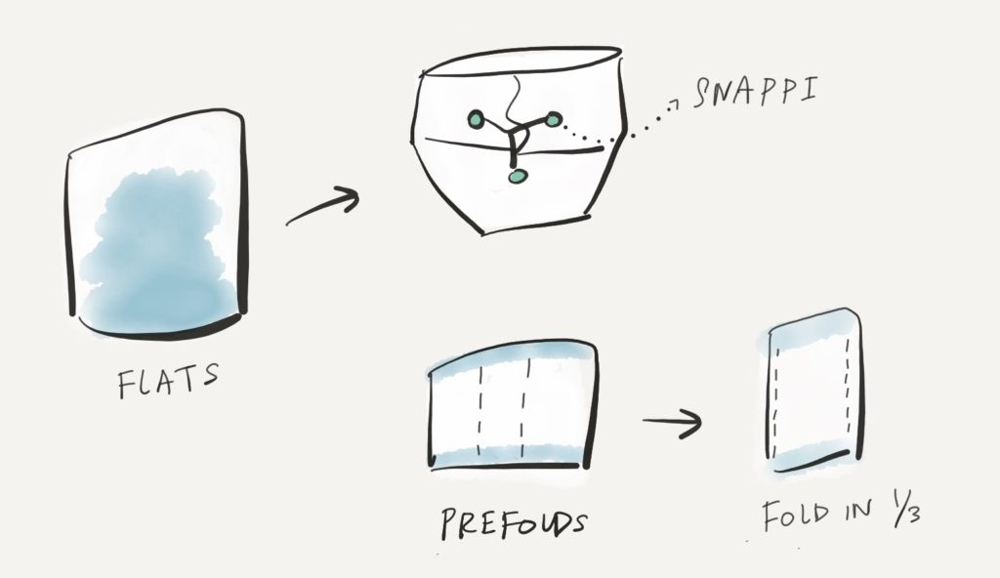
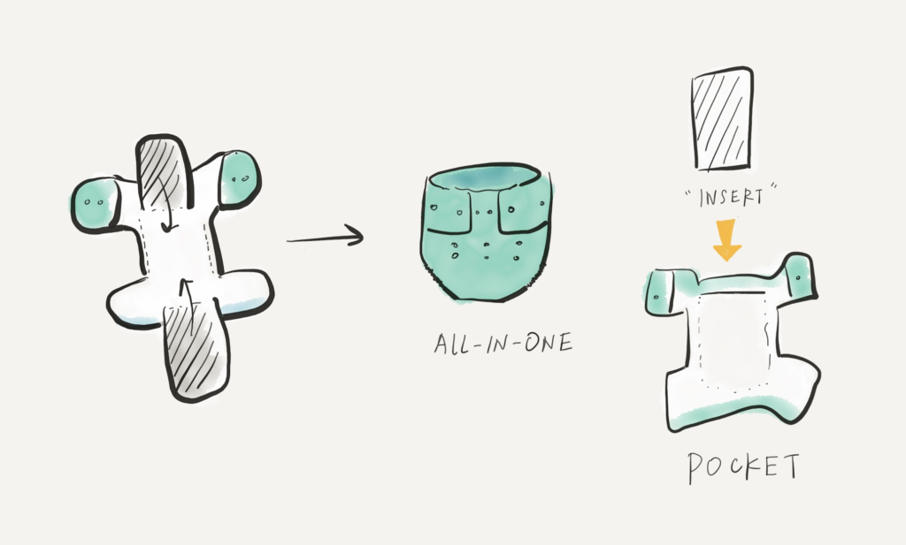

I read up a bunch on cloth diaperings before I started to buy my own stash but it was hard to come across a good article introducing the various options for cloth diapering.

## Overview
1. Flats
2. Prefolds
3. Contour
4. Fitted
5. Pocket
6. All-in-ones

### Non-waterproof
* **Flats:** This is what my father used when he was a little kid. A big old square of cloth that requires a lot of folding to get it to the desired size for diapering. Not my type of parenting. Sorry, Grandma.

* **Prefolds:** This is essentially what you would get once the flat has been folded into a square. There is minimal folding involved with prefolds. It gives you more customizability in terms of poo/pee coverage. If you like origami or your baby wee a lot, then prefolds are great options to prevent leaks. The downside of customizability is that you need a diaper pin or a [Snappi](https://amzn.to/2Ejr8Wb) to secure it. You can also consider folding in 1/3 as use it as a pad for female babies. 

* **Contour:** There are no velcros, but the shape is getting closer to a modern-day disposable diaper. No origami needed. Master folding skill = none. You still need a diaper pin or a [Snappi](https://amzn.to/2Ejr8Wb).

* **Fitted:** It is one level up from the prefolds and contours…closely mimicking a modern-day disposable diaper with snaps. However, it is not water-proof, so you might want to get a [diaper cover](https://www.thinking-about-cloth-diapers.com/baby-diaper-covers.html) to go with it.

### Waterproof

* **Pocket:** Most pocket style cloth diapers have snaps and velcros. There is also a “pocket” where you put in the “soaker” pads. It is essentially a diaper with a secret compartment in the bum area to absorb the wee/poo. Most people go with pockets because it does not have a high learning curve to master. Doing laundry might be painful because you gotta remove those “soaker” pads every time and put them back once your diaper is dry. It is lined with PUL (polyurethane laminate) on the outside for most brands. For cheap cloth diapers, sometimes the PUL will separate from the cloth diaper itself if it was dried inside of the dryer.

* **All-in-one AKA AIO:** People that hate folding laundry might want to consider AIO because it doesn’t require pad stuffing after wash. AIO usually have pads that can flip upwards or downward for drying. However, they might take the longest to dry given its complexity.

### What I ended up getting…
1. Prefolds
2. Pockets
3. AIOs

## One size for all bébés?

There is no one size fits all for babies. Most moms out there seem to buy a few brands to try and a few different combos of soaker pads for leak-proofing.

I got prefolds because it seems like they require the least amount of prep with the most amount of flexibility for coverage. I like the fact that you can wrap it around the waist area to prevent leaks. Soaker pads concentrate the soaking power right behind the bum like a period pad. Once you hit the max absorbency capacity, you will probably get leak upwards (blowout) or towards the sides.

It should be pretty safe to use a pocket or AIO at the start with a newborn as long as the newborn is not tiny and there is no gap around the leg area for leaks. You are probably changing the diaper as frequently as you feed the bebe (every 3–4 hours = 6 times a day), so you are not so concerned about max absorbency.

I ended up going with OsoCozy’s organic [prefolds](https://amzn.to/2DR2VVK) (traditional style).

There are usually two sizes of OsoCozy prefolds:  
**newborn**(7–15 lbs or 3–7kg) and **large**(15–30 lbs or 7–14kg). Most infants should hit about 13 lbs by 3 months based on a standardized growth chart (yes I am a doctor), so I figure I should just get a bigger size since it is a bigger square and I can fold it to make the diaper last longer.

I would probably pair the prefold with a pocket diaper (without the soaker pads) and test it out once I can get baby L to sleep through the night. I thought this video was great at teaching you how to pair a prefold with a diaper shell. I was sold on getting some GroVia cloth diapers after binging a bunch of these videos on their youtube channel.

I read a lot of reviews on pocket diapers and seem like [BumGenius 5.0](https://amzn.to/2V4EIlR) had high ratings and the solid patterns are gender-neutral (baby L does not want to reveal its sex yet).

A lot of moms rave about [Grovia O.N.E](https://amzn.to/2Eh09dZ) which was supposed to be the “one” diaper for all families. It has both snaps or hook & loop closure and its flexibility with additional soaker pad pairing makes it a good night-time diaper as well.

I am super excited to receive these cute cloth diapers in the mail in the next couple of weeks!
