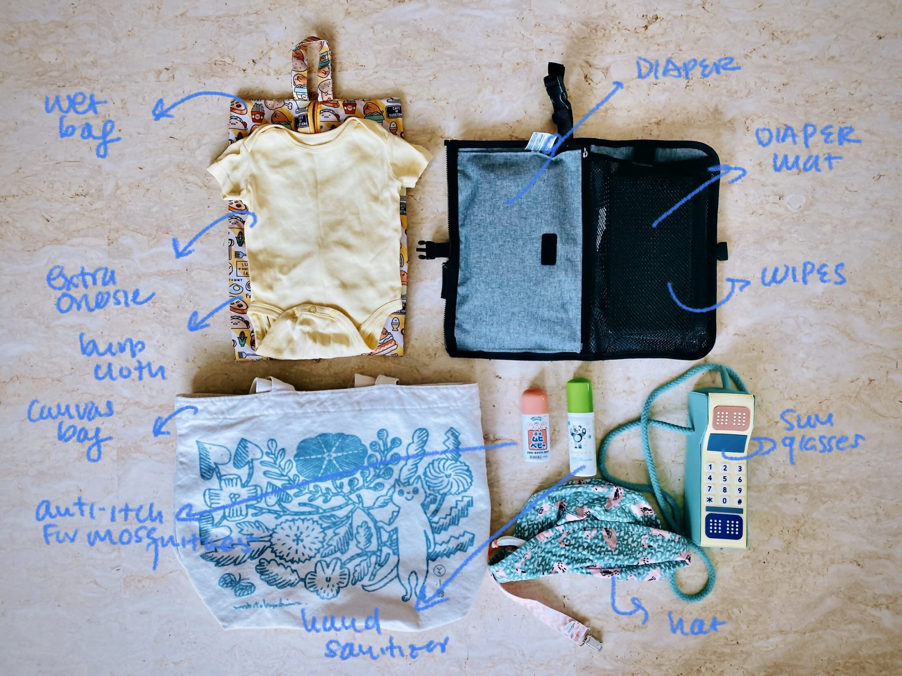

My diaper bag is perpetually packed. I like to pack light and bring only the essentials when I go outside with baby L. The rule of the thumb is that the diaper bag cannot be heavier than baby L. If it is heavier than my baby then  I will have a hard time carrying her while I wait for a taxi or when she is fussing while we take the public transport. 

I have watched at least 6 hours worth of Youtube moms showing the content of their diaper bags. They seem to pack the baby's whole life in a bag, so I can confidently tell you that I am definitely not one of them. 

## The essentials
* Diapers<
* Diaper mat 
* Wet wipes (small packet)
* Sunglasses for baby L
* Hat for baby L
* Hand sanitizer
* Anti-itch mosquito glue
* Burp cloth
* Extra onesie
* Wet bag
* Extra canvas bag (not shown)

## How Long do You Spend Outside?

Duration of our outings tends to be 3-4 hours at a time, meaning that we eat for 1 hour and look around for 2+ hours. Most of our outings are grocery shopping-related trips on the weekends. If we are going somewhere and we know that we are going to miss her milk time then we would bring a bottle of breastmilk with a cup so we can ask for hot water at the restaurant to heat up her milk. Hot water is a common thing that the restaurants would serve in Asia. If I live in the U.S. then I would need a thermos to warm up the milk. 

## Do You Unpack Your Diaper Bag?

No, the easiest way to get yourself out of the door with a baby in tow would be to leave your diaper bag packed at all times. Remember to refill the diapers every time you use it. 

## How Long Does It Take for You to Leave?

If A and I were prepping to leave, I tend to take the longest to wash my face, brush my teeth, and get dress. Baby L takes about 5-10 minutes to get ready while she waits for me.

**Take away point:** A perpetually packed bag is the best way of not missing out any item when you go out with a baby. Pack it once and pack it well. 